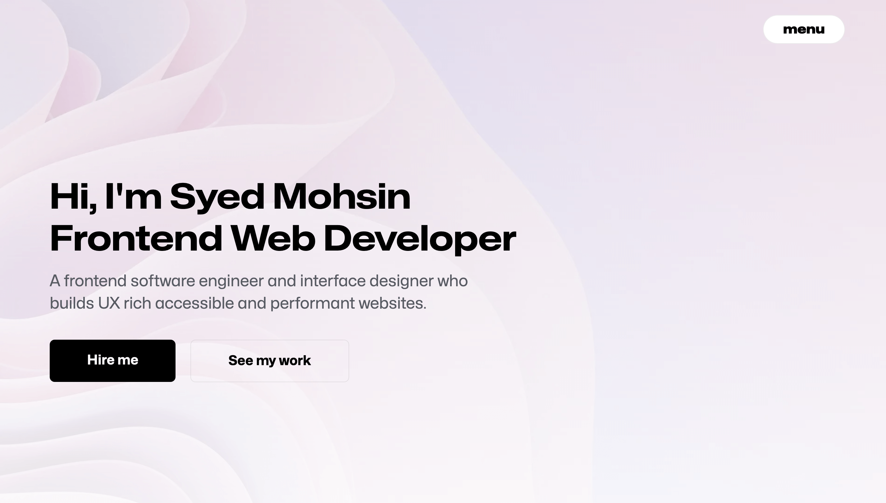

# David Mandado Portfolio

Personal portfolio website for David Mandado, a Data Science and Computer Science & Engineering student based in Eindhoven. The site presents my background in MLOps, applied machine learning, data engineering, analytics, consulting, and software engineering through a clean single-page interface.

The portfolio is built as a static website with plain HTML, CSS, and JavaScript. It does not require a build step, package manager, backend, or framework to run.



## Links

- Website: [www.cyrusml.com](https://www.cyrusml.com)
- Repository: [github.com/DavidMandado/MyPortfolio](https://github.com/DavidMandado/MyPortfolio)
- GitHub profile: [github.com/DavidMandado](https://github.com/DavidMandado)
- LinkedIn: [david-mandado-loureiro](https://www.linkedin.com/in/david-mandado-loureiro-a75a51330/)
- Email: [david.manda.loureiro@gmail.com](mailto:david.manda.loureiro@gmail.com)

## About The Site

This repository contains the source for my portfolio homepage. It is designed primarily for desktop viewing while remaining responsive on thinner laptop windows, tablets, and mobile screens.

The current version includes:

- A hero section with my profile, location, focus area, and education summary.
- A selected projects section with category filters and expandable case-study modals.
- A professional experience section covering MLOps, consulting, and data science roles.
- An education and coursework section for my double bachelor's program.
- A short interests section describing the areas where I want to contribute next.
- Resume and contact modals available from the header and call-to-action areas.
- Light and dark theme support with saved user preference.
- Responsive layouts for desktop, tablet, and mobile screens.
- Accessible dialog, button, navigation, and image labeling patterns.

## Portfolio Content

### Current Focus

I am focused on the intersection of data science and software engineering: building machine learning workflows, data products, analytical tools, and reliable systems that can move from experimentation into practical use.

Core areas represented in the portfolio:

- MLOps and deployment workflows
- Applied machine learning
- Data engineering and analytics
- Dashboard and data product development
- Software engineering and product interfaces
- Business and data consulting

### Featured Projects

#### Addressing Real-World Crime and Security Problems with Data Science

A data science dashboard project that combines large-scale crime records, socio-economic data, and geographic boundaries into forecasting models and an interactive mapping interface.

Highlights:

- Processed and integrated 900K+ monthly crime records.
- Engineered spatial and temporal features from crime and geographic data.
- Built forecasting workflows and a dashboard-oriented analysis experience.

Main stack:

- Python
- pandas
- NumPy
- scikit-learn
- LightGBM
- TensorFlow/Keras
- GeoPandas
- Flask/Dash
- SQL
- Git/GitHub

#### University Data Challenge - X-ray ML Model

A deep learning diagnostic model for chest X-ray analysis with preprocessing, augmentation, training, and multi-class model evaluation.

Highlights:

- Developed a medical image classification workflow.
- Integrated preprocessing and augmentation into the modeling pipeline.
- Evaluated performance while considering efficiency, ethics, and multi-class disease prediction requirements.

Main stack:

- Python
- PyTorch
- OpenCV
- scikit-learn
- pandas
- NumPy
- Docker
- Jupyter
- Git/GitHub

#### University Airline Twitter Analysis

An NLP analytics project focused on multilingual Air France tweets. The project cleaned and standardized social media text, stored processed data, and used sentiment analysis to extract customer support insights.

Highlights:

- Analyzed tweets from regional Air France accounts.
- Cleaned multilingual text for downstream analysis.
- Stored processed data in SQLite.
- Used sentiment analysis to evaluate support-performance patterns.

Main stack:

- Python
- pandas
- SQLite
- SQL
- NLTK
- spaCy
- VADER
- scikit-learn
- matplotlib
- Jupyter

## Experience Represented

### MLOps Engineer - mih360

April 2026 - Present

Architecting and automating CI/CD pipelines for machine learning workflows, with a focus on moving models from experimental notebooks into production-ready APIs and reproducible deployments.

Tools and areas:

- Python
- FastAPI
- GitHub Actions
- Docker
- Git
- Linux
- CI/CD

### Data Consultant - 180 Degrees Consulting Tilburg

February 2026 - Present

Advising organizations on data-driven strategy and operational improvement through business analysis, analytical frameworks, market analysis, and financial analysis.

Tools and areas:

- Excel
- Data analysis
- Business analysis
- Market analysis
- Financial analysis

### Junior Data Scientist - mih360

June 2025 - April 2026

Applied machine learning to industrial optimization and workforce analytics, developing predictive models, statistical learning pipelines, and operational decision-support systems.

Tools and areas:

- Python
- pandas
- scikit-learn
- SQL
- Jupyter
- Git
- Statistical modeling

## Education

Double Bachelor: Data Science and Computer Science & Engineering

2023 - Present

Joint Data Science program at Eindhoven University of Technology and Tilburg University, combined with Computer Science & Engineering at Eindhoven University of Technology.

Relevant coursework represented on the site:

- Statistical Computing
- Data Mining
- Econometrics for Data Science
- Data Management for Data Analytics
- Visualization
- Data Science Research Methods
- Probability and Statistics for Computer Science
- Software Design
- Computer Systems
- Algorithms

## Features

### Interface

- Fixed glass-style header with section navigation.
- Desktop-first hero layout with responsive image scaling.
- Mobile menu for narrow screens.
- Project filter tabs for ML, data, software, and web work.
- Case-study modal system for deeper project detail.
- Resume modal with print/save-as-PDF support.
- Contact modal that opens a pre-filled email draft.
- Toast feedback for copying contact information.

### Theme

- Light mode and dark mode.
- Theme preference stored in `localStorage`.
- Theme is applied before the page renders to avoid a visible flash.

### Responsiveness

- Desktop layout optimized for larger PC screens.
- Intermediate layout rules for thinner browser windows and tablets.
- Mobile layout with stacked content, compact project cards, and smaller profile imagery.
- Responsive modals and grids for project details, resume content, courses, and contact actions.

### Accessibility

- Semantic page structure with `header`, `main`, `section`, `article`, `aside`, `footer`, and `dialog`.
- Descriptive labels for navigation, icon buttons, modals, and major regions.
- Keyboard closable menus and dialogs.
- Reduced-motion media query support.
- Alt text for meaningful images.

## Tech Stack

- HTML5
- CSS3
- Vanilla JavaScript
- Native browser dialogs
- CSS custom properties
- CSS Grid and Flexbox
- Local Mona Sans font asset
- Static image and document assets

There are no npm dependencies in this version.

## Project Structure

```text
.
|-- index.html
|-- style.css
|-- script.js
|-- README.md
`-- assets
    |-- documents
    |   `-- david_cv_professional.pdf
    |-- fonts
    |   `-- Mona-Sans.woff2
    `-- images
        |-- myprofpic.jpg
        |-- sharing-card.png
        |-- webicon (2).png
        |-- work
        |-- trusted-by
        |-- testimonials
        |-- skills
        `-- social-links
```

## Run Locally

Because the portfolio is a static site, you can open it directly in a browser.

```sh
git clone https://github.com/DavidMandado/MyPortfolio.git
cd MyPortfolio
```

Then open `index.html`.

If you prefer to serve it locally, run any simple static server from the repository root:

```sh
python -m http.server 8000
```

Then visit:

```text
http://localhost:8000
```

Another option is:

```sh
npx serve .
```

## Deployment

This site can be deployed by uploading the repository contents to any static hosting provider.

Good deployment targets include:

- GitHub Pages
- Netlify
- Vercel
- Cloudflare Pages
- Hostinger static hosting

For GitHub Pages:

1. Push the repository to GitHub.
2. Open the repository settings.
3. Go to Pages.
4. Select the branch and root folder that contain `index.html`.
5. Save the configuration and wait for GitHub Pages to publish the site.

No build command is required.

## Main Files

### `index.html`

Defines the portfolio content, semantic page sections, modals, navigation, metadata, social sharing tags, and links to assets.

### `style.css`

Contains the full visual system: theme variables, layout, typography, responsive behavior, modals, cards, buttons, animations, and print styles.

### `script.js`

Handles interactivity:

- Mobile navigation state
- Light/dark theme switching
- Project filtering
- Case-study modal rendering
- Resume and contact modal behavior
- Email copy toast
- Contact form `mailto:` generation
- Reveal-on-scroll animation
- Active section navigation highlighting
- Footer year update

## Updating Content

Most portfolio content lives directly in `index.html`.

Project modal data lives in the `projectDetails` object in `script.js`. To add or edit a project, update:

- `kicker`
- `title`
- `period`
- `focus`
- `image`
- `description`
- `stack`
- `sections`
- `gallery`
- `link`

The visual design and responsive behavior live in `style.css`.

## License

This repository currently does not include an open-source license. The portfolio text, images, CV, and personal branding assets are personal material.

## Contact

For opportunities, collaborations, internships, work, or technical conversations:

- Email: [david.manda.loureiro@gmail.com](mailto:david.manda.loureiro@gmail.com)
- LinkedIn: [linkedin.com/in/david-mandado-loureiro-a75a51330](https://www.linkedin.com/in/david-mandado-loureiro-a75a51330/)
- GitHub: [github.com/DavidMandado](https://github.com/DavidMandado)
